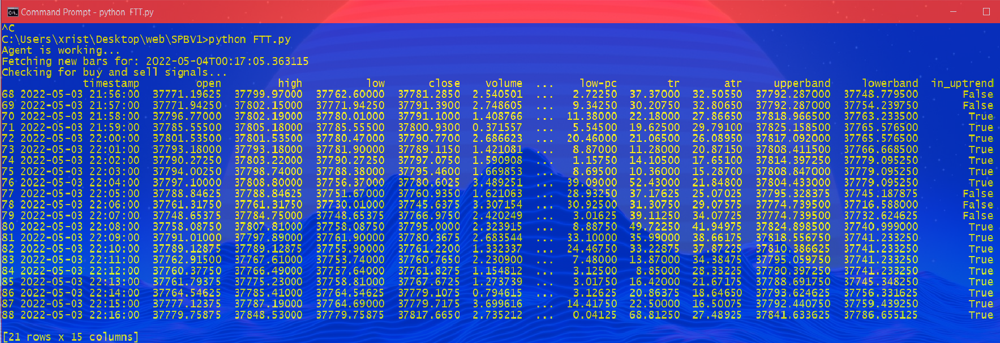

## follow-the-trend 🚀

A trading bot made with Python, which executes orders on trend changes.

The strategy we are following is called Supertrend.

A 'Supertrend' indicator is one, which can give you precise buy or sell signal in a trending market.

As the name suggests, 'Supertrend' is a trend-following indicator.

The bot is connected with binance by utilizing binanceAPI.


## Install Dependencies 🛠

Install Python dependencies provided in the `requirements.txt` file.

Run the following line in the project directory: 

```
pip install -r requirements.txt
```


## Create user configuration 🔑

All of the options provided in `config.py` should be configured.

**The configuration file consists of the following fields:**

-   **API_KEY** - Binance API key generated in the Binance account setup stage.
-   **API_SECRET** - Binance secret key generated in the Binance account setup stage.
-   **SYMBOL** - Trading pair.
-   **QUANTITY** - Amount of tokens to trade.
-   **TIMEFRAME** - Selected timeframe.
-   **LOOKBACK** - Initialize the bot by setting a lookback period . (In a 1-min strategy, LOOKBACK = 90 --> Last 90 minutes)
-   **LOGS_DISPLAYED** - Number of logs to display while running the bot.

In the same file we configure the Supertrend strategy with the following factors:

-   **ATR_FACTOR** - Average True Range(ATR) is a factor which computes the degree of price volatility.
-   **PERIOD** - Time period.

You should note the following points:

- Smaller settings of **ATR_FACTOR** and **PERIOD** can make the indictor more reactive to the price which means, more signals.
- Higher settings of **ATR_FACTOR** and **PERIOD** will remove the noise from the market at the risk of less trading signals.

```
API_KEY = 'Your Binance Api Key goes here'
API_SECRET = 'Your Binance Api Secret goes here'
SYMBOL = "BTC/USDT" 
QUANTITY = 0.05
TIMEFRAME = '1m'
LOOKBACK = 90
ATR_FACTOR = 1
PERIOD = 5
LOGS_DISPLAYED = 20
```

After configuration is being made, save file `Ctrl+S` and exit.

Note: The bot is trading paper-money by default, to prevent any loss.

If you want to disable paper-trading, head to the main file: `FTT.py`, comment out line 22, save and exit.

```
#exchange.set_sandbox_mode(True)
```


## Deploy Bot 🤖

Run the following line in the project directory: 

```
python FTT.py
```
An instance of the bot running on the above settings:




Exit at any time with `Ctrl+C`.


## Disclaimer ✔

This software is for educational purposes only. Do not risk money which you are afraid to lose. USE THE SOFTWARE AT YOUR OWN RISK. I ASSUME NO RESPONSIBILITY FOR YOUR TRADING RESULTS.

Always start by running a trading bot in PAPER-TRADING and do not engage money before you understand how it works and what profit/loss you should expect.

I strongly recommend you to have coding and Python knowledge. Do not hesitate to read the source code and understand the mechanism of this bot.
